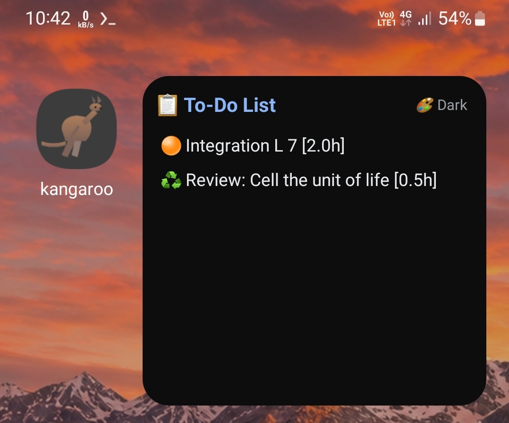
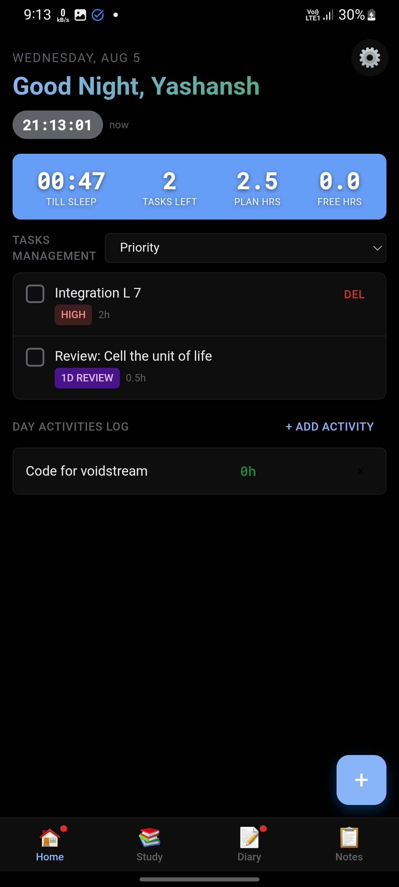

# DoDo

A privacy-friendly, offline-first productivity app that combines To-Do lists, Spaced Repetition learning, and a personal Diary.

## Features

* **Smart To-Do List:** Create tasks, set priorities, add non-important tasks for free time, and set time.
* **Free Time Tracker:** The app automatically calculates and tells you your free time and working hours.
* **Spaced Repetition System:** A dedicated section to write down what you have read or learned so you can revise it effectively. These revision tasks will also show up in the To-Do list and widget.
* **Personal Diary:** Write your daily thoughts and notes securely.
* **Home Screen Widget:** Quick access to your To-Do list and what to revise directly from the home screen.

## Privacy & Cloud Sync

This app is completely **offline-first**. Your data stays safe on your device by default. 

Cloud Sync is **optional** and highly secure. It uses **AES-256 Encryption** to protect your data before uploading.
* You can use your own custom PHP hosting (like InfinityFree or any paid hosting).
* The app includes a built-in tutorial and the server code (PHP) to easily set up your sync server.
* **Warning:** If you forget your Encryption Password, data recovery is almost impossible. No one can read the data without the key.
* The app does not force any tracking or non-free networks by default.

## Author

**Yashansh**
Contact: [yashansh@proton.me](mailto:yashansh@proton.me)

## License

This project is licensed under the [GPL-3.0 License](LICENSE).
## Screenshots

